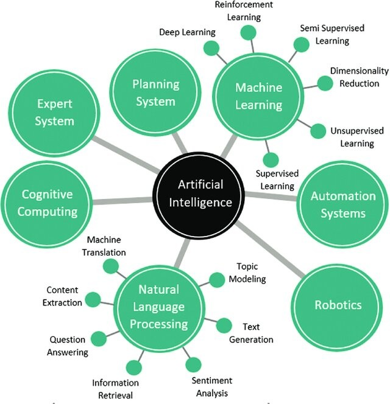
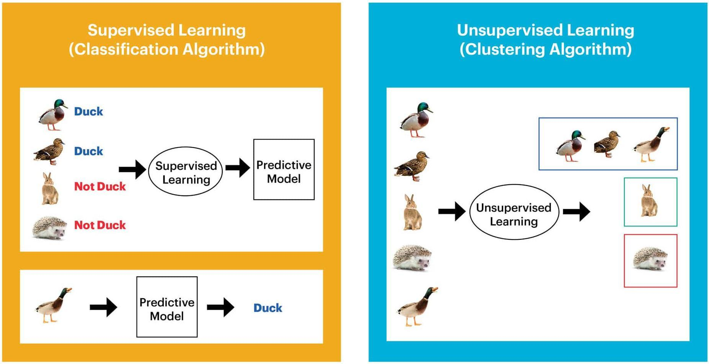

<h1 align="center">🧠 বাংলায় Deep Learning!</h1>

## পরিচিতি
আমরা প্রায় সবাই Deep Learning, Machine বা Artificial Intelligence এই শব্দগুলোর সাথে পরিচিত, হয়তো কোন বই বা YouTube ভিডিও থেকে। কিন্তু এগুলোর কোনটা আসলে কি? নিচের এই ছবিটা থেকে আমরা একটা বিস্তর ধারণা নিতে পারি!

<p align="center"></p>

এখানে আমরা দেখতে পাচ্ছি Machine Learning (ML) হচ্ছে Artificial Intelligence (AI) এর একটি Sub-field আবার Deep Learning (DL) হচ্ছে Machine Learning (ML) এর Sub-field।

Deep Learning এ মূলত আমরা Artificial Neural Network (ANN) নামের এক ধরণের অ্যালগরিদম ব্যবহার করি, যেটা মানুষের মস্তিষ্ক (brain)-এর মতো কাজ করে! Deep Learning কে আমরা সহজ ভাবে বলতে গেলে এটিও একটি Unsupervised Machine Learning টেকনিক!

```
🤔 Supervised আর Unsupervised আবার কি?

Supervised ML: যেখানে ইনপুট ফিচার গুলোর কোনটি কি নির্দেশ করে এবং আউটপুট কি হবে তা বলে দেওয়া হয় ML অ্যালগরিদম কে।

Unsupervised ML: সহজ কথাই Supervised এর উল্টা! যেখানে ইনপুট ফিচার গুলোর কোনটি কি নির্দেশ করে এবং আউটপুট কি হবে তার কিছুই বলে দেওয়া হয় না ML অ্যালগরিদম কে।
```
নিচের ছবিটি থেকে Supervised ও Unsupervised Model কিভাবে কাজ করে তার একটা পরিষ্কার ধারণা পাওয়া যায়।

<p align="center"></p>

## 🧩 Deep Learning কীভাবে কাজ করে?
Deep Learning model-এর মূল ভিত্তি হলো — Neuron (এটা মানুষের মস্তিষ্কের neuron-এর মতোই Conceptually!) এখানে নিউরন বলতে এমন একটা Mathematical ফাংশনকে বুঝায় যা-
- কিছু ইনপুট নেয় (যেমনঃ x1, x2, x3 .. xn)
- প্রতিটি ইনপুট ভ্যালুর সাথে একটি Weight (w1, w2, w3 .. wn) গুন করে
- এবং সবশেষে একটা bias ভ্যালু (b) যোগ করে
- সব calculation শেষে output (y) পাওয়া যায়

Equation আকারে তা নিচের মতো করে দেখানো হয়- 

$$
y = f\left(\sum_{i=1}^{n} w_i x_i + b\right)
$$
